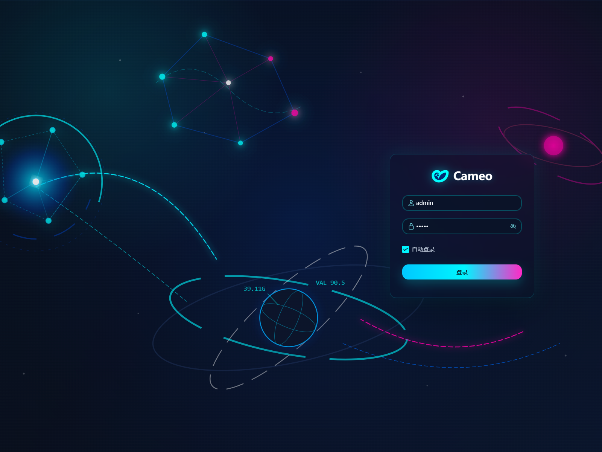
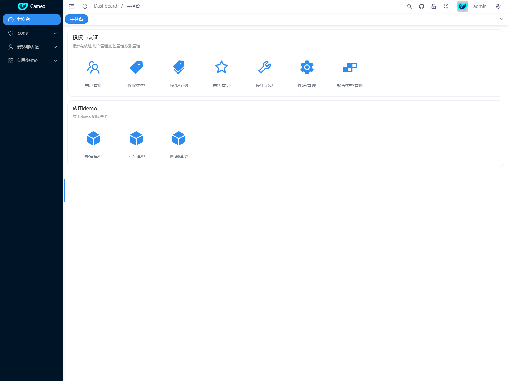
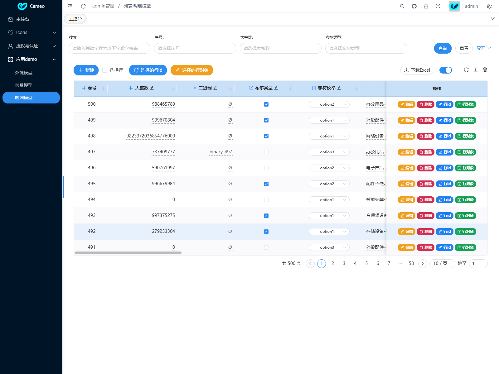
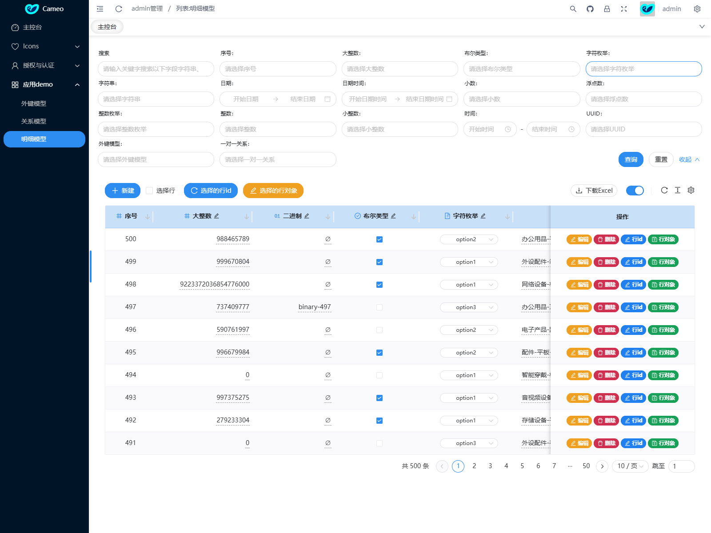
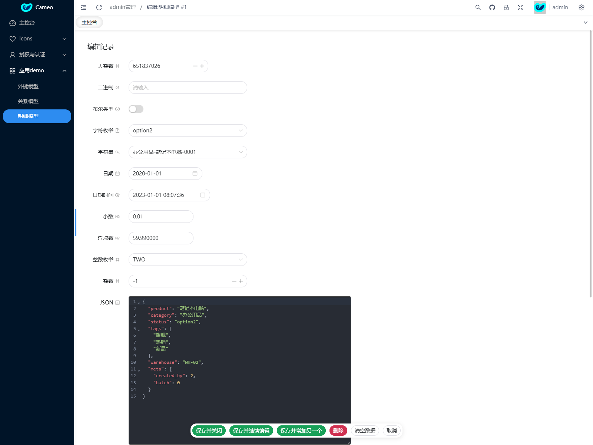
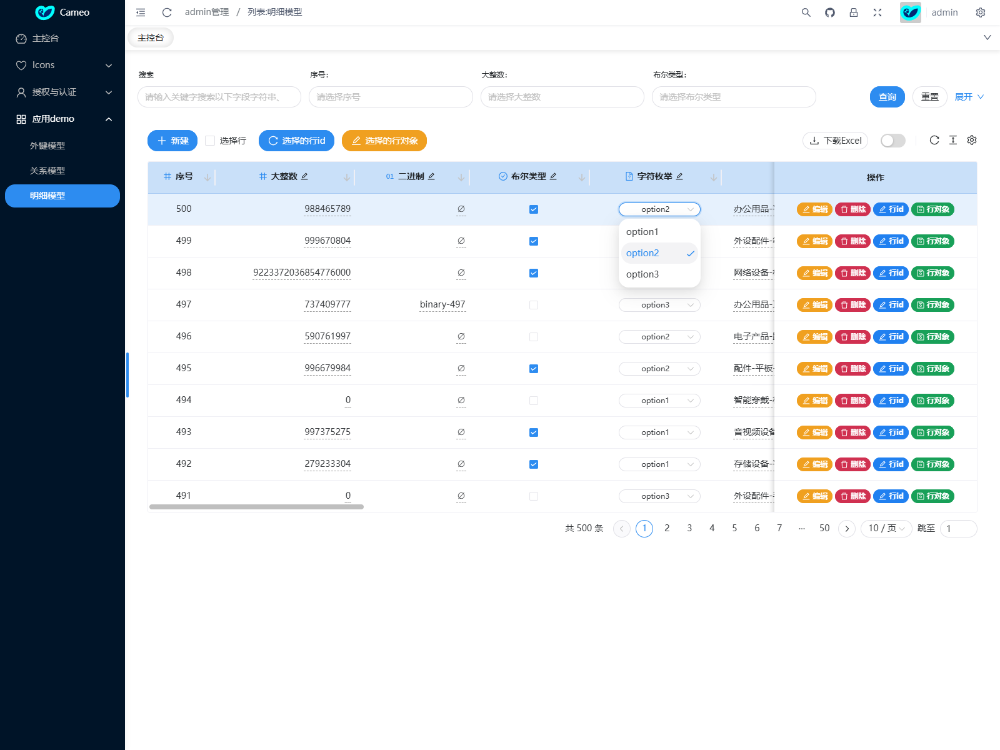
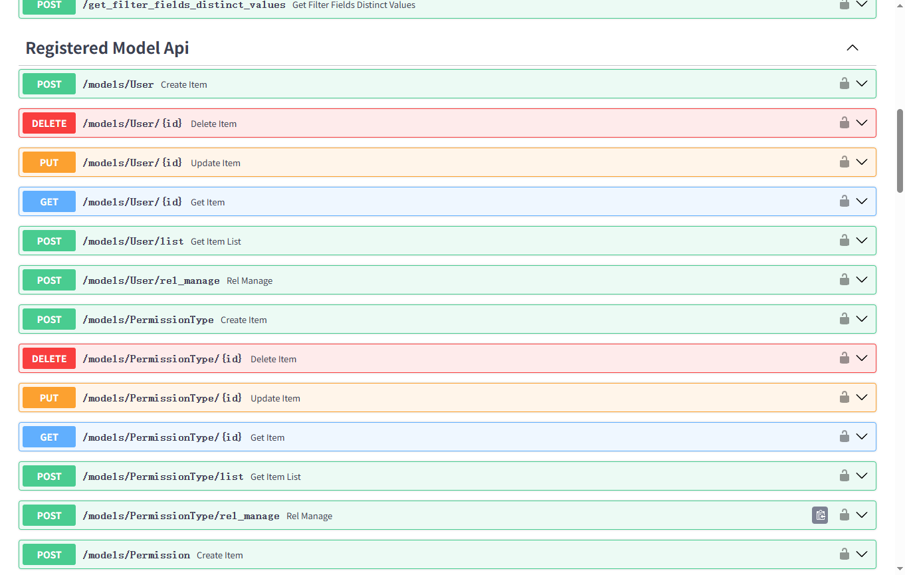

# Cameo

<p align="center">
  <a href="#"></a>
</p>

<p align="center">
  <strong>基于 FastAPI、SQLAlchemy 2.0、Vue 3 和 Naive UI 的后台管理框架</strong>
</p>

## 简介

Cameo 是一个前后端分离的后台管理系统框架。后端使用 FastAPI 和 SQLAlchemy 2.0，前端使用 Vue 3、Vite、Naive UI 和 pnpm。项目内置 `udadmin` 管理应用，并提供 `demo` 示例应用，用于展示模型注册、自动 CRUD、权限控制、字段类型、关系字段和自定义动作。

核心能力：

- 自动 CRUD：注册 SQLAlchemy 模型后生成列表、详情、新增、编辑、删除等接口和页面。
- RBAC 权限：内置用户、角色、权限类型、权限实例和操作记录。
- 模型 UI 配置：通过 `UiInfo`、`FieldInfo` 配置列表列、筛选项、搜索项、可编辑字段和自定义动作。
- 国际化：后端 `locales/zh.yml`、`locales/en.yml` 和前端 `front/src/i18n` 协同提供中英文显示。
- Demo App：覆盖外键、一对一、多对多、枚举、JSON、日期、布尔、数字、文本等常见模型场景。
- Docker Compose：支持容器内前端打包，并用 Python slim 镜像启动后端服务。

## 项目地址

- GitHub: https://github.com/croonyy/cameo
- Gitee: https://gitee.com/croonyy/cameo

## 效果展示

### 登录页

深色科技风登录界面，默认演示账号为 `admin/admin`，适合后台管理系统的入口场景。



### 主控台

登录后的主控台展示系统导航、标签页、快捷工具栏和概览面板，用于承载后台首页与运营数据入口。



### 模型列表

基于后端模型自动生成 CRUD 列表，支持分页、排序、批量选择、行操作、列宽调整和横向滚动。



### 查询过滤

列表页内置模型字段过滤区，能够按字段类型生成输入框、选择器、布尔筛选等查询控件。



### 编辑表单

编辑页根据模型字段生成表单，覆盖数字、文本、日期、枚举、JSON 等常见字段类型。



### 行内编辑

列表支持行内编辑模式，可在表格中直接修改枚举、布尔值等字段，减少频繁跳转表单页的操作成本。



### API 文档

后端基于 FastAPI 自动生成 Swagger API 文档，便于调试认证、CRUD 和业务接口。



## 技术栈

后端：

- FastAPI
- SQLAlchemy 2.0 async
- Alembic
- SQLite 默认数据库，可按 `DATABASE_URL` 切换 MySQL 或 PostgreSQL
- JWT 认证
- 数据库认证和 LDAP 认证后端

前端：

- Vue 3
- Vite
- Naive UI
- Pinia
- Alova
- pnpm 10.5.0
- Node.js 22

## 应用结构

当前主应用在 `main.py` 中挂载子应用：

- `/udadmin`：后台管理应用，包含用户、角色、权限、配置、操作记录等管理模型。
- `/demo`：示例应用，展示自动 CRUD 和复杂字段/关系。
- `/static`：静态资源目录，前端生产构建产物位于 `static/admin`。
- `/admin`：后台前端入口，生产构建后由后端直接返回 `static/admin/index.html`。

`config/settings.py` 中的 `REGISTERED_APPS` 控制挂载应用：

```python
from apps.udadmin.utils.app_registry import AppReg

REGISTERED_APPS = [
    AppReg("apps.udadmin.app:app", app_icon="antd:UserOutlined"),
    AppReg(app_path="apps.demo.app:app"),
]
```

`AppReg` 支持四个参数：

- `app_path`：FastAPI app 导入路径，必填，例如 `AppReg("apps.udadmin.app:app")` 或 `AppReg(app_path="apps.demo.app:app")`。
- `router_prefix`：挂载路径，默认 `/<app 目录名>`，例如 `/udadmin`、`/demo`。
- `app_name`：应用名称，默认 app 目录名。
- `app_icon`：前端应用图标，默认 `antd:AppstoreOutlined`。

## Demo App

`apps/demo` 提供三个示例模型：

- `ForeignKeyModel`：外键目标模型，用于测试一对多关系。
- `RelationModel`：关系模型，用于测试一对一和多对多关系。
- `DetailModel`：明细模型，覆盖 BigInteger、LargeBinary、Boolean、Enum、String、Date、DateTime、Numeric、Float、Integer、JSON、Text、Time、ForeignKey、relationship 等字段。

`apps/demo/ui.py` 展示了模型 UI 配置：

- `list_display=["*"]` 显示全部字段。
- `list_filter` 配置筛选字段。
- `search_fields` 配置搜索字段。
- `editable_fields` 配置行内编辑字段。
- `custom_actions` 配置行级和工具栏自定义动作。

`apps/demo/routers/actions.py` 提供自定义动作接口，并通过 `permission_required` 绑定权限，例如：

- `/demo/actions/detail/preview_row`
- `/demo/actions/detail/preview_record`
- `/demo/actions/detail/show_context`
- `/demo/actions/detail/show_records`

## 本地开发

### 环境要求

- Python 3.12+
- Node.js 22+
- pnpm 10.5.0

### 初始化

```bash
pip install -r requirements.txt
python -m alembic upgrade head
python init_data.py
```

`init_data.py` 会重建默认 SQLite 数据库并写入测试数据，包括用户、角色、权限、配置、操作记录和 demo 数据。

常用账号：

- `admin` / `admin`
- `test_user` / `123456`
- `demo_user` / `123456`
- `empty_user` / `123456`

### 启动后端

```bash
python run.py
```

本地开发脚本默认监听：

```text
http://localhost:3014
```

### 启动前端开发服务

```bash
cd front
corepack enable
corepack prepare pnpm@10.5.0 --activate
pnpm install
pnpm run dev
```

前端开发服务端口以 Vite 配置为准。生产构建时前端会输出到 `static/admin`。

## Docker Compose

项目根目录提供 `docker-compose.yml`，包含两个服务：

- `frontend-build`：使用 `node:22-alpine` 安装依赖并执行前端打包。
- `backend`：使用 `python:3.12-slim` 构建并运行后端，暴露 `3014` 端口。

### 一键启动

```bash
# 如果第一次启动需要构建前端，需要加参数 --profile build
docker compose --profile build up
# 如果不是第一次
docker compose up
```

启动后访问：

```text
http://localhost:3014
http://localhost:3014/admin
http://localhost:3014/docs
http://localhost:3014/udadmin/docs
http://localhost:3014/demo/docs
```

日常启动已构建过的后端镜像时可以使用：

```bash
docker compose up -d backend
```

代码或依赖变更后再重新构建：

```bash
docker compose up -d --build backend
```

### 完整容器流程

```bash
docker compose run --rm frontend-build
docker compose up -d --build backend
```

如果需要查看日志：

```bash
docker compose logs -f backend
```

如果需要停止服务：

```bash
docker compose down
```

## 目录结构

```text
cameo/
├─ apps/
│  ├─ udadmin/              # 后台管理应用
│  │  ├─ models.py          # 用户、角色、权限、配置等模型
│  │  ├─ ui.py              # 管理应用 UI 配置
│  │  ├─ app.py             # udadmin FastAPI 子应用
│  │  ├─ routers/           # 路由
│  │  └─ utils/             # 认证、权限、国际化、模型注册等工具
│  └─ demo/                 # 示例应用
│     ├─ models.py          # 示例模型
│     ├─ ui.py              # 示例模型 UI 配置
│     ├─ app.py             # demo FastAPI 子应用
│     └─ routers/actions.py # 自定义动作接口
├─ config/
│  ├─ settings.py           # 默认配置
│  └─ local_settings.py     # 本地覆盖配置，可选
├─ db/
│  └─ db.sqlite3            # 默认 SQLite 数据库
├─ front/                   # Vue 前端工程
├─ locales/                 # 后端国际化资源
├─ static/
│  └─ admin/                # 前端生产构建产物
├─ main.py                  # 主 FastAPI 应用
├─ run.py                   # 本地开发启动脚本
├─ init_data.py             # 初始化测试数据
├─ requirements.txt         # Python 依赖
└─ docker-compose.yml       # 容器编排配置
```

## 模型注册

模型通过 `apps.udadmin.utils.model_register.mr` 注册到子应用，注册后会生成对应 CRUD API 和前端所需元数据。

示例：

```python
from apps.udadmin.utils.model_register import mr
from apps.demo import models as md
from apps.demo import ui

mr.register(app, md.DetailModel, ui_info=ui.DetailModelUi)
```

`UiInfo` 常用配置：

```python
DetailModelUi = UiInfo(
    model=md.DetailModel,
    list_display=["*"],
    list_filter=["id", "boolean_field", "char_enum_field"],
    search_fields=["char_field", "text_field", "uuid_field"],
    editable_fields=["char_field", "boolean_field", "json_field"],
)
```

## 管理外部数据库

Cameo 可以把已经存在的数据库表接入后台管理。这个场景的方向是“数据库到模型”：数据库结构已经存在，手动或通过反射工具生成 SQLAlchemy 模型，然后注册到一个独立 app 中进行 CRUD 管理。不要对外部数据库执行 Alembic 迁移，也不要在应用启动时对外部数据库调用 `Base.metadata.create_all()` 或 `drop_all()`。

基本步骤：

1. 准备外部数据库，例如 `db/db_external.sqlite3`，其中已经存在业务表和数据。
2. 在 `config/settings.py` 的 `DATABASES` 中新增一个数据库配置项。
3. 在 `apps/` 下新建独立 app，例如 `apps/db_external/`。
4. 根据外部数据库表生成或手写 `apps/db_external/models.py`。
5. 配置 `apps/db_external/ui.py`，声明列表字段、筛选字段、搜索字段、可编辑字段等。
6. 通过 `Base = get_base(database="db_external", app_name="db_external")` 让模型继承对应数据库和应用的 Base，`mr.register()` 会自动使用对应数据库连接和 app 名。
7. 在 `config/settings.py` 的 `REGISTERED_APPS` 中注册该 app。
8. 外部数据库结构变化后，手动同步修改 `models.py`，不生成迁移文件。

外部数据库配置示例：

```python
# config/settings.py
import os


DATABASES = {
    "default": {
        "url": DATABASE_URL,
        "engine_options": {
            "echo": SQL_LOG,
            "connect_args": {"check_same_thread": False}
            if DATABASE_URL.startswith("sqlite")
            else {},
        },
        "managed_by_alembic": True,
    },
    "db_external": {
        "url": f"sqlite+aiosqlite:///{os.path.join(BASE_DIR, 'db', 'db_external.sqlite3')}",
        "engine_options": {
            "echo": SQL_LOG,
            "connect_args": {"check_same_thread": False},
        },
        "managed_by_alembic": False,
    },
}
```

外部表模型示例：

```python
# apps/db_external/models.py
from typing import cast

from sqlalchemy import Boolean, Column, DateTime, Integer, String
from sqlalchemy.orm import relationship

from apps.udadmin.utils.ui_tools import FieldInfo
from apps.udadmin.utils.model_base import get_base


Base = get_base(database="db_external", app_name="db_external")


class Department(Base):
    __tablename__ = "department"

    id = Column(Integer, primary_key=True, autoincrement=True, info=FieldInfo(ui_name="ID"))
    name = Column(String(100), nullable=False, unique=True, info=FieldInfo(ui_name="部门名称"))
    code = Column(String(50), nullable=False, unique=True, info=FieldInfo(ui_name="部门编码"))
    location = Column(String(100), info=FieldInfo(ui_name="办公地点"))
    is_active = Column(Boolean, nullable=False, default=True, info=FieldInfo(ui_name="启用"))
    created_at = Column(DateTime, info=FieldInfo(ui_name="创建时间"))

    employees = relationship("Employee", back_populates="department")

    def __str__(self) -> str:
        name = cast(str | None, self.name)
        return name or f"<Department: {self.id}>"

    class Meta:
        menu_name = "外部部门"
        table_description = "外部数据库中的部门表"
```

UI 配置示例：

```python
# apps/db_external/ui.py
from apps.udadmin.utils.ui_tools import UiInfo
from apps.db_external import models as md


DepartmentUi = UiInfo(
    model=md.Department,
    list_display=["id", "name", "code", "location", "is_active", "created_at"],
    list_filter=["id", "is_active"],
    search_fields=["name", "code", "location"],
    editable_fields=["name", "code", "location", "is_active"],
    readonly_fields=["created_at"],
)
```

app 注册示例：

```python
# apps/db_external/app.py
from fastapi import FastAPI
from fastapi import exceptions as excep
from starlette.exceptions import HTTPException

from apps.db_external import models as md
from apps.db_external import ui
from apps.udadmin.utils import error_handler as eh
from apps.udadmin.utils import middleware as mw
from apps.udadmin.utils.model_register import mr
from apps.udadmin.utils.openapi_tags import openapi_tags


app = FastAPI(title="db_external", version="1.0.0", debug=True, openapi_tags=openapi_tags)

app.exception_handler(excep.RequestValidationError)(eh.RequestValidationErrorHandler)
app.exception_handler(HTTPException)(eh.HttpExceptionHandler)
app.exception_handler(eh.AppException)(eh.AppExceptionHandler)
app.middleware("http")(mw.LocaleMiddleware)
app.middleware("http")(mw.CommonExceptionHandler)

mr.register(app, md.Department, ui_info=ui.DepartmentUi)
```

主配置注册示例：

```python
# config/settings.py
from apps.udadmin.utils.app_registry import AppReg


REGISTERED_APPS = [
    AppReg("apps.udadmin.app:app", app_icon="antd:UserOutlined"),
    AppReg("apps.demo.app:app"),
    AppReg(
        app_path="apps.db_external.app:app",
        router_prefix="db_external",
        app_icon="antd:DatabaseOutlined",
    ),
]
```

模型使用哪个数据库的判断顺序是：优先读取模型类自己的 `database`；如果模型没有声明，则读取继承的 Base 上的数据库名；如果 `get_base()` 没有传入数据库名，并且模型也没有声明，则默认使用 `settings.DATABASES` 中配置的第一个数据库连接。

模型使用哪个 app 的判断顺序是：优先读取模型类自己的 `app_name`；如果模型没有声明，则读取继承的 Base 上的 app 名；如果 Base 没有声明，则读取当前正在挂载的 `AppReg.app_name`；如果没有挂载上下文，则从模型模块路径推断，例如 `apps.db_external.models` 推断为 `db_external`；最后才从表名前缀推断。该模型的列表、详情、新增、编辑、删除、筛选值接口都会使用最终解析出的数据库和 app。

同一个数据库里可以有多个 app，例如 `udadmin` 和 `demo` 都使用 `database="default"`，但分别使用 `app_name="udadmin"` 和 `app_name="demo"`。这些 app 共享同一个数据库 metadata，只是模型注册和前端路由归属不同。

注意事项：

- 外部数据库不参与当前项目的 Alembic 迁移。
- 外部数据库变更后，手动同步 `apps/db_external/models.py`。
- Base 的 `app_name` 应和 app 注册名保持一致，例如 `db_external`。
- 外部库模型应通过 `get_base(database="数据库名", app_name="应用名")` 获取对应 `Base`，不要继承默认库的 Base。
- 需要关系字段时，照常声明 `ForeignKey` 和 `relationship`，但要保证模型定义和现有数据库约束一致。

## 数据库迁移

生成迁移：

```bash
python -m alembic revision --autogenerate -m "change description"
```

执行迁移：

```bash
python -m alembic upgrade head
```

回滚一版：

```bash
python -m alembic downgrade -1
```

## 配置说明

常用配置位于 `config/settings.py`：

- `DATABASE_URL`：数据库连接地址。
- `DATABASES`：多数据库连接注册表，默认第一项为未声明 `model.database` 时使用的数据库。
- `REGISTERED_APPS`：子应用挂载配置。
- `AUTHENTICATION_BACKENDS`：认证后端。
- `LDAP_CONFIG`：LDAP 参数。
- `SYNC_REGISTERED_MODEL_PERMISSIONS`：启动时同步已注册模型权限。
- `SECRET_KEY`、`ACCESS_TOKEN_EXPIRE_SECONDS`、`REFRESH_TOKEN_EXPIRE_SECONDS`：JWT 配置。

本地私有配置可写入 `config/local_settings.py` 覆盖默认值。

## 访问入口

- 后台页面：`http://localhost:3014/admin`
- 主应用文档：`http://localhost:3014/docs`
- 管理应用文档：`http://localhost:3014/udadmin/docs`
- Demo 应用文档：`http://localhost:3014/demo/docs`

## License

见 [LICENSE](LICENSE)。
